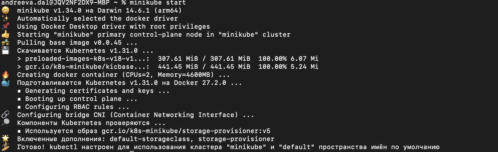
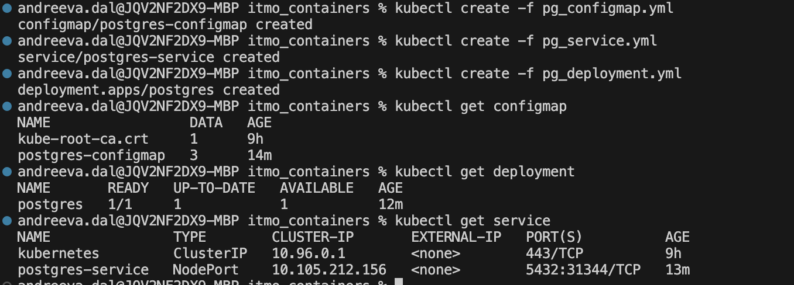
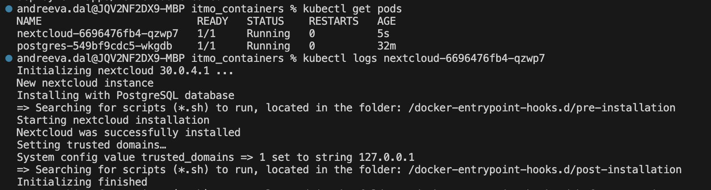
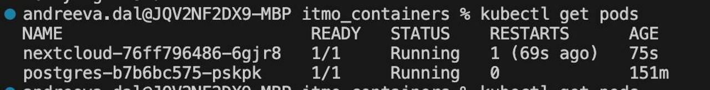

# Лабораторная работа 3

## Задача
### 1 Установка minikube

Установлено, проверено, запущено!

### 2 Создаем объекты через CLI

Создали и проверили

Создали и проверили сущности из nextcloud

Где-то с третьего раза оно поднялось
я такая тупая блин класссссс 💅💅💅

### 3 Задание

Файлы отредачены, запущены, поднято

#### Теория

Важен ли порядок выполнения этих манифестов? Почему?
Ответ: Да, в большинстве случаев оно не запустится, если деплоить до конфига или сикрета (пробовала ли я? да, случайно)

Что (и почему) произойдет, если отскейлить количество реплик postgres-deployment в 0, затем обратно в 1, после чего попробовать снова зайти на Nextcloud?
Ответ: Если отскейлить реплики postgres-deployment до 0, БД будет недоступной. После возвращения количества реплик к 1 база данных снова будет работать, но Nextcloud сам по себе не восстановит соединение.

Бонус, потому что это лаба вытрясла из меня душу:

