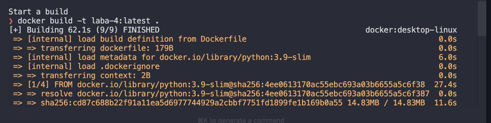
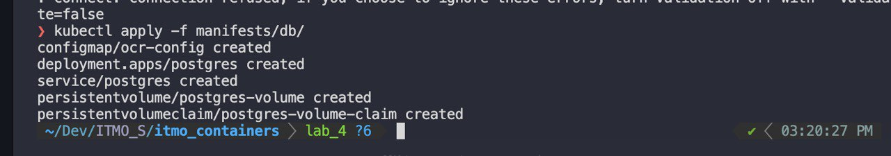
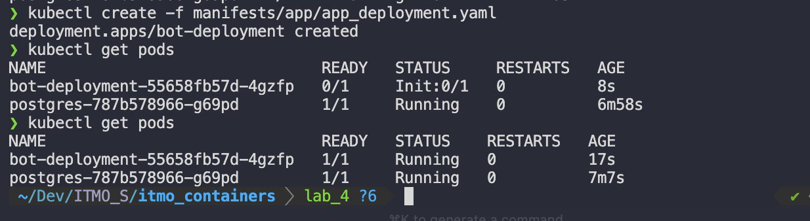

# Ход работы

1. Запускаем через docker desktop кубер (решил использовать его вместо minikube)
2. Билдим образ с помощью `docker build -t laba-4:latest .`
   
3. Загрузка образа не нужна, поскольку в docker desktop общий registry для образов
4. Создаем объекты для базы данных
   
   
5. Разворачиваем контейнер с аппкой и инитом, получаем рабочие поды
   
6. Мы молодцы, все работает
